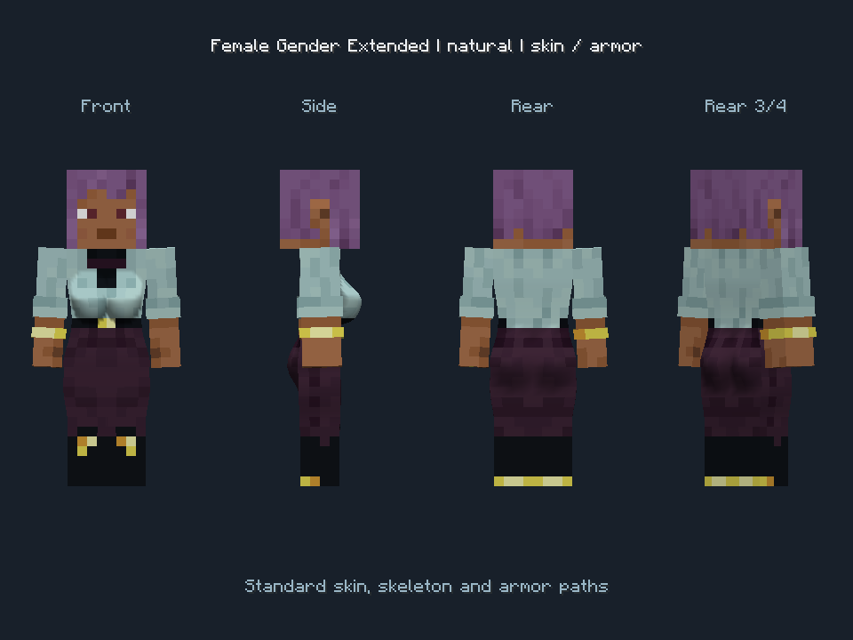
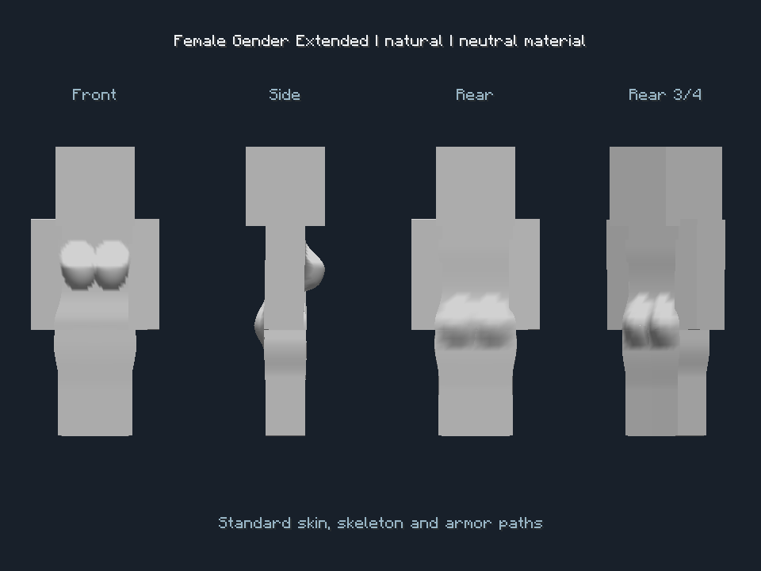
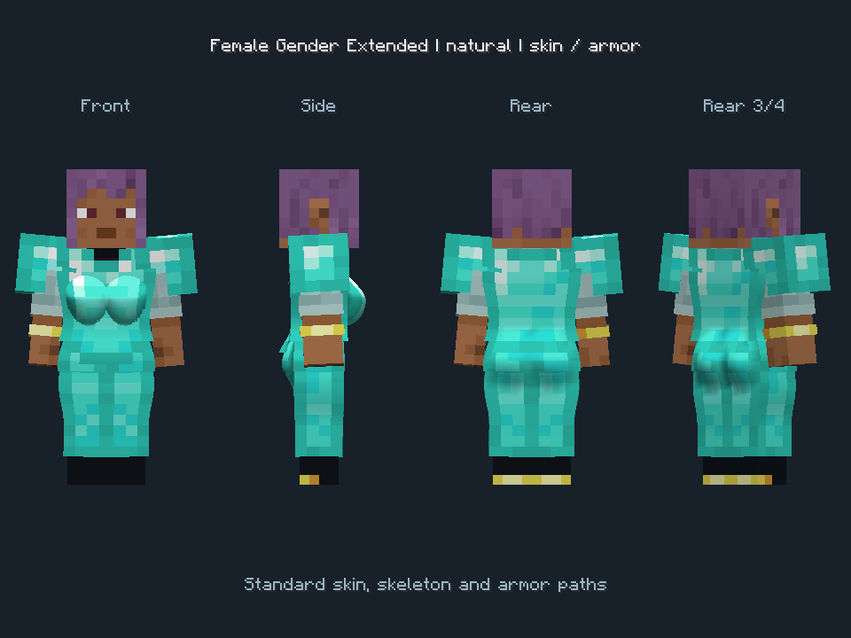

# Female Gender Extended — NeoForge 1.21.1

An independent fork of [FemaleGenderMod/FemaleGenderMod](https://github.com/FemaleGenderMod/FemaleGenderMod), based on its `neoforge-1.21.1_sync` branch at `1733351d389d149e11da809e484957668a24ccdb`. Original mod by WildfireRomeo and contributors; fork additions by Female Gender Extended contributors.

## Features

- Bust slider extended from the original 100% maximum to 150% (internal range 0–1.2, previously 0–0.8).
- Classic, Rounded and Natural breast models with curved lower contours and smooth shading. Natural has a gradual upper slope and fuller lower profile.
- Adjustable hips, upper thighs, buttocks and waist for female player models, with conservative proportions and unchanged gameplay hitboxes.
- Paired buttock contours sit at the pelvis and blend into the lower torso and uppermost thighs.
- Acceleration-driven, damped breast and buttock motion, including walk, jump, landing and turning response. Rigid armor holds still; soft coverings reduce motion.
- Standard skin layers and humanoid armor follow the body shape, including ordinary armor dyes, trims and enchantment effects.
- Optional extended multiplayer profiles, validated by the server and resent when players enter tracking range. Older clients receive the original supported settings.

## Install and customize

Use Minecraft **1.21.1**, **NeoForge 21.1.248 or newer**, and **Java 21**. Put the built `Female-Gender-Extended-neoforge-1.21.1-4.3.0-extended.1.jar` into `mods` on clients and the server. Replace the original Female Gender Mod jar: both share the `wildfire_gender` mod ID and cannot be installed together.

Press **G**, open the appearance customization screen, then choose **Body shape & motion**. Start with **Natural preset** and adjust the sliders to taste. Zero body sliders and Classic give the original geometry path. Existing settings live in `config/WildfireGender`; back them up when switching forks or downgrading.

All participants and the server need the fork to synchronize the added settings. Client-only installation still supports local customization. Extended cloud synchronization is not supported by this release.

Read [compatibility boundaries](docs/COMPATIBILITY.md) before using custom armor or a replacement player renderer. Arbitrary third-party meshes are not guaranteed to fit automatically.







## Build and automated verification

```powershell
./gradlew.bat test build runGameTestServer --no-daemon
```

The release jar and source jar are written to `build/libs`. Tests cover numerical stability, interpolation, geometry seams, armor envelopes, profile validation, persistence, legacy encoding and server packet handling. A separate development test mod contains two scripted Minecraft clients and a localhost server; it is excluded from release jars. See [validation](docs/VALIDATION.md) for actual outcomes and how to reproduce the runtime checks.

See [physics research and implementation decisions](docs/PHYSICS-RESEARCH.md) for sources, model assumptions and practical limits.

## License

LGPL-3.0-or-later, retaining upstream notices. See [LICENSE](LICENSE) and [LICENSE-GPL](LICENSE-GPL). The corresponding modified source, build files, tests and research notes are included in this repository.
